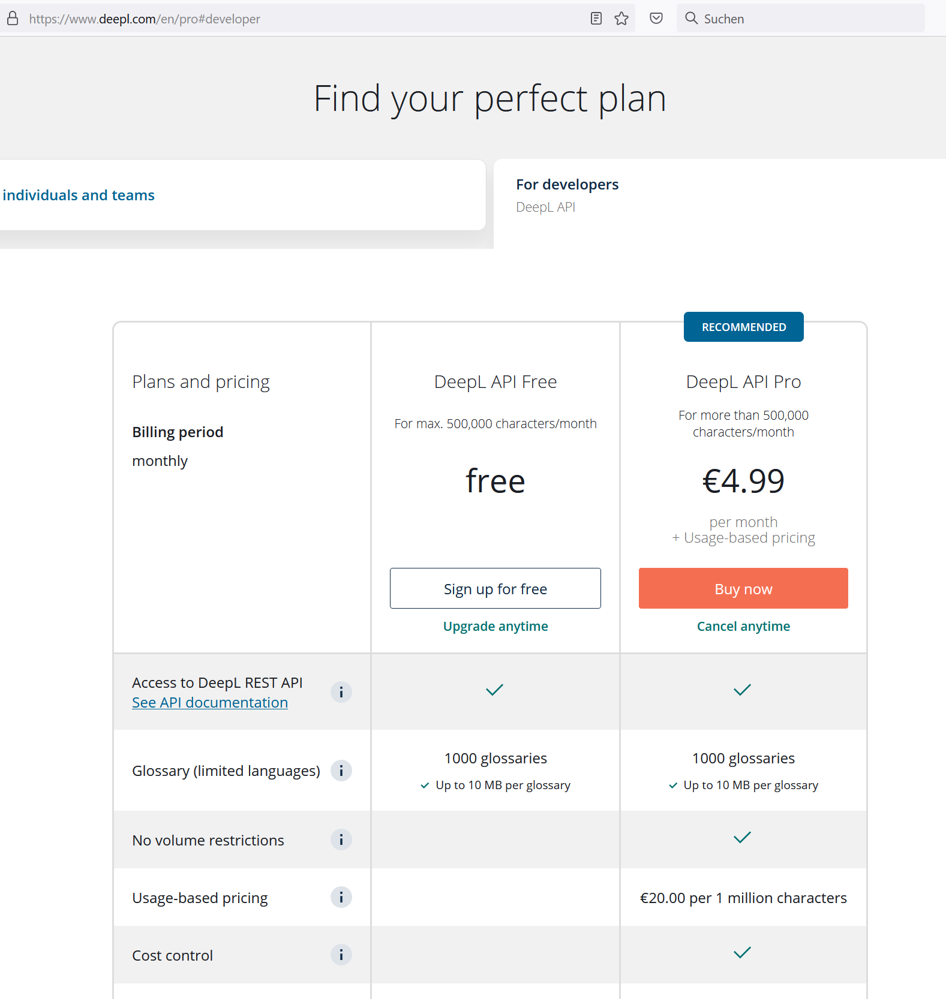

# TranslateCSV 2.0

---

> 🇩🇪 [Deutsch](#deutsch) &nbsp;|&nbsp; 🇬🇧 [English](#english) &nbsp;|&nbsp; 🇫🇷 [Français](#français)

---

## Deutsch

### Was macht dieses Programm?

**TranslateCSV** ist ein Windows-Programm mit grafischer Oberfläche zum Übersetzen von CSV-Dateien aus dem Spiel **Empyrion – Galactic Survival** (oder beliebigen anderen Szenarien) mithilfe der [DeepL-API](https://www.deepl.com/translator).

Das Programm übersetzt die Textinhalte einer bestimmten Spalte in einer CSV-Datei automatisch und schreibt die Übersetzungen direkt in die Ziel-Spalte zurück.

---

### ⚠️ Wichtig: Übersetzungslimit beim Programmstart

> **Das Programm startet IMMER mit einem Limit von 5 Übersetzungen** (Einstellung „Max. Übersetzungen" im Tab „Erweitert").

Dies ist ein Sicherheitsmechanismus, damit bei der ersten Verwendung keine unnötigen API-Kosten entstehen und man das Ergebnis zunächst prüfen kann.

**Vorgehensweise:**
1. Starte das Programm und konfiguriere alle Einstellungen
2. Führe eine erste Übersetzung mit dem Limit = 5 aus
3. Prüfe, ob die 5 Einträge korrekt übersetzt wurden (Zieldatei öffnen)
4. Wenn alles stimmt: setze das Limit auf **0** (= unbegrenzt) und starte erneut

---

### 💳 DeepL-Konto & Kosten

Für die Übersetzung wird ein kostenloser oder kostenpflichtiger DeepL-API-Schlüssel benötigt.

| Kontotyp | Zeichen/Monat | Kosten | Schlüssel endet auf |
|---|---|---|---|
| **Free** | 500.000 | kostenlos | `:fx` |
| **Pro** | unbegrenzt | kostenpflichtig | (beliebig) |

> 💡 **Tipp:** Den kostenlosen API-Schlüssel bekommst du unter: https://www.deepl.com/pro#developer



Der kostenlose Account reicht für normale Szenarien gut aus – aber Vorsicht: Das monatliche Kontingent wird bei größeren CSV-Dateien schnell verbraucht. Nutze das **Übersetzungslimit** und die **Referenzdatei**, um bereits übersetzte Texte nicht erneut zu übersetzen.

---

### 📄 ECF-Dateien zu CSV konvertieren

Viele Empyrion-Konfigurationsdateien liegen als `.ecf`-Dateien vor (z. B. `TokenConfig.ecf`, `TraderNPCConfig.ecf`). Diese müssen zuerst in das CSV-Format umgewandelt werden. Dafür steht das Programm **ECFtoCSV** zur Verfügung.

**Beispieldateien:**
```
C:\GAMES\Steam\steamapps\workshop\content\383120\3143225812\Content\Configuration\TokenConfig.ecf
C:\GAMES\Steam\steamapps\workshop\content\383120\3143225812\Content\Configuration\TraderNPCConfig.ecf
```

**Workflow:**
1. ECF → CSV konvertieren (ECFtoCSV)
2. CSV übersetzen (TranslateCSV)
3. CSV → ECF zurückkonvertieren (ECFtoCSV)

---

### 🖥️ Bedienung

1. **Tab „🔑 API & Sprachen"**
   - DeepL-API-Schlüssel eingeben
   - Kontotyp wählen (Free / Pro)
   - Quellsprache (Spaltenname in der CSV, z. B. `English`)
   - Zielsprache (Spaltenname in der CSV, z. B. `Deutsch`)
   - DeepL-Sprachcode (z. B. `DE`, `FR`, `ES`)

2. **Tab „📁 Dateien"**
   - Eingabedatei (Pflicht): die zu übersetzende CSV-Datei
   - Ausgabedatei (optional): leer lassen = Eingabedatei wird direkt überschrieben
   - Referenzdatei (optional): eine alte Version der CSV – bereits vorhandene Übersetzungen werden direkt übernommen, ohne die API aufzurufen

3. **Tab „⚙ Erweitert"**
   - **Max. Übersetzungen**: beim Start immer **5** – für Tests. Auf **0** setzen für eine vollständige Übersetzung
   - Parallele API-Aufrufe: Standard 8, erhöhen für schnellere Übersetzung großer Dateien

4. **▶ Übersetzung starten** – das Protokollfenster zeigt den Fortschritt in Echtzeit

---

### 📦 Installation

Keine Installation notwendig – einfach die ZIP herunterladen, entpacken und starten:

1. Öffne den **[Releases-Bereich](../../releases/latest)** dieses Repositories (rechte Seitenleiste auf GitHub → „Releases")
2. Lade unter der neuesten Version die Datei **`TranslateCSV.zip`** herunter
3. Entpacke die ZIP in einen beliebigen Ordner
4. Starte **`TranslateCSV.exe`**

> **.NET muss nicht installiert sein** – das Programm ist vollständig eigenständig (Standalone-EXE).

---
---

## English

### What does this program do?

**TranslateCSV** is a Windows application with a graphical interface for translating CSV files from the game **Empyrion – Galactic Survival** (or any other scenario) using the [DeepL API](https://www.deepl.com/translator).

The program automatically translates the text content of a specific column in a CSV file and writes the translations back into the target column.

---

### ⚠️ Important: Translation limit on startup

> **The program ALWAYS starts with a limit of 5 translations** (setting "Max. translations" in the "Advanced" tab).

This is a safety mechanism to prevent unnecessary API costs on first use and to allow you to review the results before running a full translation.

**Recommended workflow:**
1. Start the program and configure all settings
2. Run a first translation with the limit = 5
3. Check whether the 5 entries were translated correctly (open the output file)
4. If everything looks good: set the limit to **0** (= unlimited) and start again

---

### 💳 DeepL account & costs

A free or paid DeepL API key is required for translation.

| Account type | Characters/month | Cost | Key ends with |
|---|---|---|---|
| **Free** | 500,000 | free | `:fx` |
| **Pro** | unlimited | paid | (any) |

> 💡 **Tip:** Get your free API key at: https://www.deepl.com/pro#developer


The free account is sufficient for most scenarios – but be careful: the monthly quota can be used up quickly with larger CSV files. Use the **translation limit** and the **reference file** to avoid re-translating texts that have already been translated.

---

### 📄 Converting ECF files to CSV

Many Empyrion configuration files are stored as `.ecf` files (e.g. `TokenConfig.ecf`, `TraderNPCConfig.ecf`). These must first be converted to CSV format. The **ECFtoCSV** program is available for this purpose.

**Example files:**
```
C:\GAMES\Steam\steamapps\workshop\content\383120\3143225812\Content\Configuration\TokenConfig.ecf
C:\GAMES\Steam\steamapps\workshop\content\383120\3143225812\Content\Configuration\TraderNPCConfig.ecf
```

**Workflow:**
1. Convert ECF → CSV (ECFtoCSV)
2. Translate CSV (TranslateCSV)
3. Convert CSV → ECF back (ECFtoCSV)

---

### 🖥️ How to use

1. **Tab "🔑 API & Languages"**
   - Enter your DeepL API key
   - Select account type (Free / Pro)
   - Source language (column name in the CSV, e.g. `English`)
   - Target language (column name in the CSV, e.g. `Deutsch`)
   - DeepL language code (e.g. `DE`, `FR`, `ES`)

2. **Tab "📁 Files"**
   - Input file (required): the CSV file to translate
   - Output file (optional): leave empty = input file will be overwritten directly
   - Reference file (optional): an older version of the CSV – existing translations are reused without calling the API

3. **Tab "⚙ Advanced"**
   - **Max. translations**: always **5** on startup – for testing. Set to **0** for a full translation run
   - Parallel API calls: default 8, increase for faster translation of large files

4. **▶ Start Translation** – the log window shows progress in real time

---

### 📦 Installation

No installation required – simply download the ZIP, extract it and run:

1. Open the **[Releases section](../../releases/latest)** of this repository (right sidebar on GitHub → "Releases")
2. Under the latest release, download **`TranslateCSV.zip`**
3. Extract the ZIP to any folder
4. Run **`TranslateCSV.exe`**

> **.NET does not need to be installed** – the program is fully self-contained (standalone EXE).

---
---

## Français

### Que fait ce programme ?

**TranslateCSV** est une application Windows avec interface graphique pour traduire les fichiers CSV du jeu **Empyrion – Galactic Survival** (ou de tout autre scénario) en utilisant l'[API DeepL](https://www.deepl.com/translator).

Le programme traduit automatiquement le contenu textuel d'une colonne spécifique d'un fichier CSV et réécrit les traductions dans la colonne cible.

---

### ⚠️ Important : limite de traduction au démarrage

> **Le programme démarre TOUJOURS avec une limite de 5 traductions** (paramètre « Traductions max. » dans l'onglet « Avancé »).

Il s'agit d'un mécanisme de sécurité pour éviter des coûts API inutiles lors de la première utilisation et pour permettre de vérifier les résultats avant de lancer une traduction complète.

**Procédure recommandée :**
1. Démarrer le programme et configurer tous les paramètres
2. Effectuer une première traduction avec la limite = 5
3. Vérifier que les 5 entrées ont été correctement traduites (ouvrir le fichier de sortie)
4. Si tout est correct : mettre la limite à **0** (= illimité) et relancer

---

### 💳 Compte DeepL & coûts

Une clé API DeepL gratuite ou payante est nécessaire pour la traduction.

| Type de compte | Caractères/mois | Coût | Clé se terminant par |
|---|---|---|---|
| **Gratuit** | 500 000 | gratuit | `:fx` |
| **Pro** | illimité | payant | (quelconque) |

> 💡 **Conseil :** Obtenez votre clé API gratuite sur : https://www.deepl.com/pro#developer


Le compte gratuit est suffisant pour la plupart des scénarios – mais attention : le quota mensuel peut être rapidement épuisé avec de grands fichiers CSV. Utilisez la **limite de traductions** et le **fichier de référence** pour éviter de retraduire des textes déjà traduits.

---

### 📄 Conversion des fichiers ECF en CSV

De nombreux fichiers de configuration d'Empyrion sont stockés sous forme de fichiers `.ecf` (p. ex. `TokenConfig.ecf`, `TraderNPCConfig.ecf`). Ceux-ci doivent d'abord être convertis au format CSV. Le programme **ECFtoCSV** est disponible à cet effet.

**Fichiers d'exemple :**
```
C:\GAMES\Steam\steamapps\workshop\content\383120\3143225812\Content\Configuration\TokenConfig.ecf
C:\GAMES\Steam\steamapps\workshop\content\383120\3143225812\Content\Configuration\TraderNPCConfig.ecf
```

**Flux de travail :**
1. Convertir ECF → CSV (ECFtoCSV)
2. Traduire le CSV (TranslateCSV)
3. Reconvertir CSV → ECF (ECFtoCSV)

---

### 🖥️ Utilisation

1. **Onglet « 🔑 API & Langues »**
   - Entrer la clé API DeepL
   - Choisir le type de compte (Gratuit / Pro)
   - Langue source (nom de la colonne dans le CSV, p. ex. `English`)
   - Langue cible (nom de la colonne dans le CSV, p. ex. `Deutsch`)
   - Code de langue DeepL (p. ex. `DE`, `FR`, `ES`)

2. **Onglet « 📁 Fichiers »**
   - Fichier d'entrée (obligatoire) : le fichier CSV à traduire
   - Fichier de sortie (optionnel) : laisser vide = le fichier d'entrée sera directement écrasé
   - Fichier de référence (optionnel) : une ancienne version du CSV – les traductions existantes sont réutilisées sans appeler l'API

3. **Onglet « ⚙ Avancé »**
   - **Traductions max.** : toujours **5** au démarrage – pour les tests. Mettre à **0** pour une traduction complète
   - Appels API parallèles : par défaut 8, augmenter pour une traduction plus rapide des grands fichiers

4. **▶ Démarrer la traduction** – la fenêtre de journal affiche la progression en temps réel

---

### 📦 Installation

Aucune installation requise – téléchargez simplement le ZIP, extrayez-le et lancez :

1. Ouvrez la section **[Releases](../../releases/latest)** de ce dépôt (barre latérale droite sur GitHub → « Releases »)
2. Sous la dernière version, téléchargez **`TranslateCSV.zip`**
3. Extrayez le ZIP dans n'importe quel dossier
4. Lancez **`TranslateCSV.exe`**

> **.NET n'a pas besoin d'être installé** – le programme est entièrement autonome (EXE standalone).